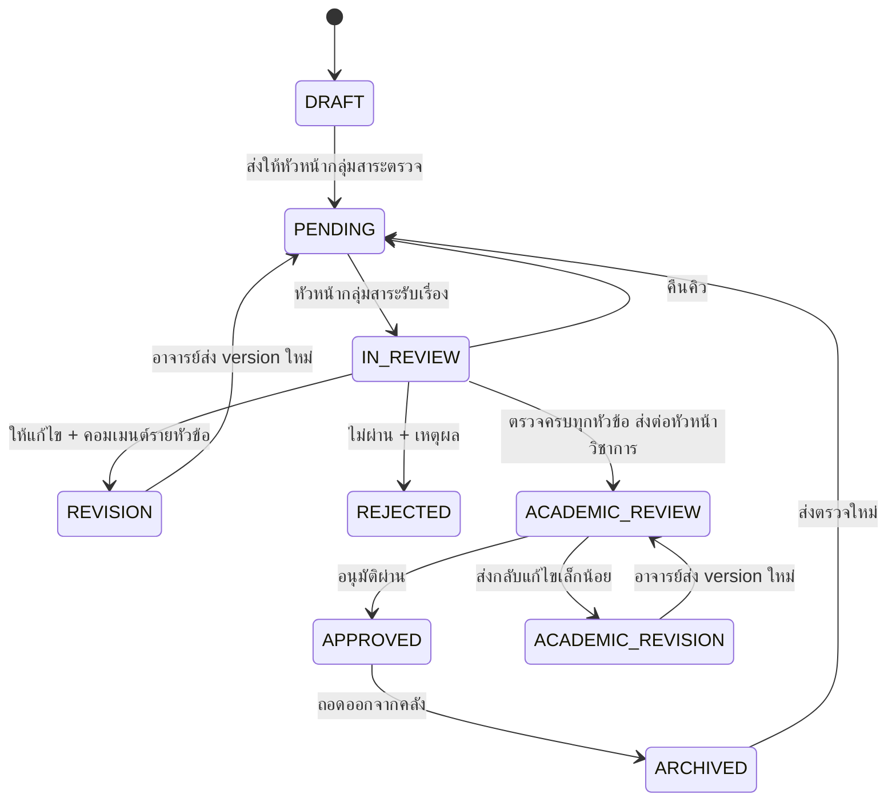

# กระบวนการตรวจอนุมัติสื่อสองชั้น

> แหล่งความจริงคือตาราง `TRANSITIONS` ใน [src/constants/workflow.ts](../src/constants/workflow.ts)
> เอกสารนี้เป็นคำอธิบายประกอบ ถ้าขัดกันให้ยึดโค้ด

## ตำแหน่งผู้ใช้

| ตำแหน่ง | ทำอะไรได้ |
|---|---|
| `TEACHER` | สร้างสื่อ เลือกกลุ่มสาระ บันทึกร่าง ส่งตรวจ แก้ไข และอ่านคอมเมนต์รายหัวข้อ |
| `REVIEWER` | หัวหน้ากลุ่มสาระ เห็นเฉพาะสื่อของกลุ่มที่ได้รับมอบหมาย ตรวจและคอมเมนต์รายหัวข้อ แล้วส่งกลับหรือส่งต่อ |
| `ACADEMIC_HEAD` | หัวหน้าวิชาการ ตรวจขั้นสุดท้าย อนุมัติ ส่งกลับแก้ไขเล็กน้อย หรือถอดออกจากคลัง · เปิดดูรายชื่อบุคลากรและตำแหน่งได้ **แต่ตั้งตำแหน่งไม่ได้** |
| `ADMIN` | ผู้ดูแลระบบ ตั้งตำแหน่งและกลุ่มสาระ เปิด/ปิดบัญชี · **ไม่มีสิทธิ์ใด ๆ ในกระบวนการตรวจสื่อ** |

`ADMIN` เป็นผู้เดียวที่เปลี่ยนตำแหน่งและกลุ่มสาระของผู้ใช้ได้ และแต่งตั้งใครเป็น `ADMIN` ผ่านหน้ารายชื่อไม่ได้
การเปลี่ยนทุกครั้งต้องมี audit log

## 9 สถานะ

| สถานะ | ป้ายภาษาไทย | ความหมาย |
|---|---|---|
| `DRAFT` | ร่าง | เจ้าของยังแก้ไขได้ ยังไม่เข้าสู่กระบวนการตรวจ |
| `PENDING` | รอตรวจโดยกลุ่มสาระ | รอหัวหน้ากลุ่มสาระที่ตรงกับ `media.department_id` รับเรื่อง |
| `IN_REVIEW` | กลุ่มสาระกำลังตรวจ | หัวหน้ากลุ่มสาระบันทึกผลและคอมเมนต์รายหัวข้อ |
| `REVISION` | ให้แก้ไข | หัวหน้ากลุ่มสาระส่งกลับพร้อมคอมเมนต์รายหัวข้อ |
| `REJECTED` | ไม่ผ่าน | หัวหน้ากลุ่มสาระปิดเรื่องพร้อมเหตุผล |
| `ACADEMIC_REVIEW` | รอตรวจโดยหัวหน้าวิชาการ | หัวหน้ากลุ่มสาระตรวจครบแล้วและส่งต่อมาตรวจขั้นสุดท้าย |
| `ACADEMIC_REVISION` | แก้ไขเล็กน้อย | หัวหน้าวิชาการส่งกลับพร้อมจุดแก้เล็กน้อย |
| `APPROVED` | เผยแพร่แล้ว | หัวหน้าวิชาการอนุมัติและนำเข้าคลังแล้ว |
| `ARCHIVED` | ถอดออกจากคลัง | เคยเผยแพร่แล้วแต่ถูกถอดออก |

## ผังเส้นทาง

## ตารางเส้นทางที่อนุญาต

| จาก | ไป | ใครทำได้ | เงื่อนไข | version ใหม่ |
|---|---|---|---|---|
| `DRAFT` | `PENDING` | เจ้าของ | metadata ครบ + ไฟล์ ≥ 1 + กลุ่มสาระปลายทาง | – |
| `PENDING` | `IN_REVIEW` | หัวหน้ากลุ่มสาระเดียวกับสื่อ | ยังไม่มีผู้ถือเรื่อง | – |
| `IN_REVIEW` | `PENDING` | ผู้ถือเรื่อง | คืนคิว | – |
| `IN_REVIEW` | `REVISION` | ผู้ถือเรื่อง | มีคอมเมนต์อย่างน้อย 1 หัวข้อ | – |
| `IN_REVIEW` | `REJECTED` | ผู้ถือเรื่อง | มีเหตุผล | – |
| `IN_REVIEW` | `ACADEMIC_REVIEW` | ผู้ถือเรื่อง | บันทึกผลตรวจครบทุกหัวข้อ | – |
| `REVISION` | `PENDING` | เจ้าของ | metadata + ไฟล์ฉบับใหม่ครบ | ✔ |
| `ACADEMIC_REVIEW` | `APPROVED` | หัวหน้าวิชาการ | ตรวจขั้นสุดท้ายแล้ว | – |
| `ACADEMIC_REVIEW` | `ACADEMIC_REVISION` | หัวหน้าวิชาการ | มีคอมเมนต์รายหัวข้ออย่างน้อย 1 ข้อ | – |
| `ACADEMIC_REVISION` | `ACADEMIC_REVIEW` | เจ้าของ | metadata + ไฟล์ฉบับใหม่ครบ | ✔ |
| `APPROVED` | `ARCHIVED` | หัวหน้าวิชาการ | มีเหตุผล | – |
| `ARCHIVED` | `PENDING` | เจ้าของ | metadata + ไฟล์ฉบับใหม่ครบ | ✔ |

เส้นทางที่ไม่อยู่ในตารางต้องปฏิเสธทั้งหมด รวมถึงกรณีหัวหน้าวิชาการ

## คอมเมนต์รายหัวข้อ

- ทุกคอมเมนต์ผูกกับ `version_id` และ `topic_key` เพื่อรู้ว่าติรอบไหนและหัวข้อใด
- `REVISION` และ `ACADEMIC_REVISION` ต้องมีคอมเมนต์อย่างน้อยหนึ่งหัวข้อ
- อาจารย์เห็นชื่อผู้ส่ง รอบตรวจ ผลรายหัวข้อ และข้อความทั้งหมด
- เมื่ออาจารย์ส่งฉบับแก้ไขต้องสร้าง `media_versions` แถวใหม่ ห้ามทับไฟล์เดิม

## การบังคับสิทธิ์

- `REVIEWER` อ่านและรับงานได้เฉพาะเมื่อ `media.department_id = profiles.department_id` ของตน
- `ACADEMIC_HEAD` อ่านคิว `ACADEMIC_REVIEW` และเป็นผู้เดียวที่อนุมัติขั้นสุดท้ายได้
- `ADMIN` เป็นผู้เดียวที่เปลี่ยนตำแหน่งหรือกลุ่มสาระได้ และถูกปฏิเสธจากคิวตรวจ รายงาน QA และการตัดสินผลตรวจทั้งหมด
- role, department, owner, assignee, ความครบถ้วนของผลตรวจ และจำนวนคอมเมนต์ต้องอ่านจาก session/ฐานข้อมูลฝั่งเซิร์ฟเวอร์
- ทุก transition ต้องผ่าน `assertTransition()` และเขียน audit/status log ใน transaction เดียวกัน
