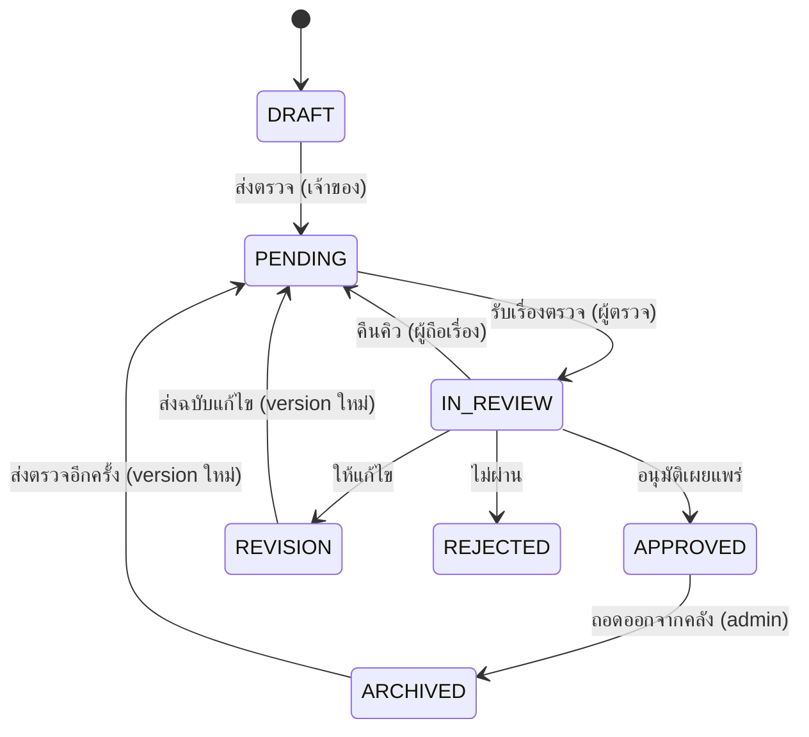

# กระบวนการตรวจอนุมัติสื่อ

> แหล่งความจริงคือตาราง `TRANSITIONS` ใน [src/constants/workflow.ts](../src/constants/workflow.ts)
> เอกสารนี้เป็นคำอธิบายประกอบ ถ้าขัดกันให้ยึดโค้ด

## บทบาทผู้ใช้

| บทบาท | ทำอะไรได้ |
|---|---|
| `TEACHER` | อัปโหลด แก้ของตัวเองตอน `DRAFT`/`REVISION` ดูสถานะและคอมเมนต์ ค้นหาสื่อที่เผยแพร่แล้ว |
| `REVIEWER` | รับเรื่องจากคิว ตรวจ ให้คอมเมนต์ ตัดสิน |
| `ADMIN` | ทุกอย่างของ `REVIEWER` + จัดการผู้ใช้ + ถอดสื่อที่เผยแพร่แล้ว |
| `VIEWER` | ค้นหา/ดาวน์โหลดเฉพาะสถานะ `APPROVED` |

## 7 สถานะ

| สถานะ | ป้ายภาษาไทย | ความหมาย |
|---|---|---|
| `DRAFT` | ร่าง | เจ้าของยังแก้ได้ ยังไม่เข้ากระบวนการตรวจ |
| `PENDING` | รอตรวจ | อยู่ในคิว รอผู้ตรวจรับเรื่อง |
| `IN_REVIEW` | กำลังตรวจ | มีผู้ตรวจถือเรื่องอยู่ |
| `REVISION` | ให้แก้ไข | ผู้ตรวจขอให้แก้แล้วส่งกลับมาใหม่ |
| `APPROVED` | เผยแพร่แล้ว | อยู่ในคลัง ค้นหาและดาวน์โหลดได้ |
| `REJECTED` | ไม่ผ่าน | ปิดเรื่อง ไม่เข้าคลัง |
| `ARCHIVED` | ถอดออกจากคลัง | เคยเผยแพร่แล้วแต่ถูกถอดออก |

## ผังเส้นทาง



## ตารางเส้นทางที่อนุญาต

**เส้นทางที่ไม่อยู่ในตารางนี้ต้องปฏิเสธทั้งหมด** ไม่มีข้อยกเว้น รวมถึงกรณี admin

| จาก | ไป | ใครทำได้ | เงื่อนไข | ปุ่ม | version ใหม่ |
|---|---|---|---|---|---|
| `DRAFT` | `PENDING` | เจ้าของ | metadata ครบ + ไฟล์ ≥ 1 | ส่งตรวจ | – |
| `PENDING` | `IN_REVIEW` | reviewer / admin | ต้องยังไม่มีใครถือ | รับเรื่องตรวจ | – |
| `IN_REVIEW` | `PENDING` | ผู้ที่ถือเรื่อง | – | คืนคิว | – |
| `IN_REVIEW` | `APPROVED` | ผู้ที่ถือเรื่อง | – | อนุมัติเผยแพร่ | – |
| `IN_REVIEW` | `REVISION` | ผู้ที่ถือเรื่อง | ต้องมีคอมเมนต์ ≥ 1 | ให้แก้ไข | – |
| `IN_REVIEW` | `REJECTED` | ผู้ที่ถือเรื่อง | ต้องมีเหตุผล | ไม่ผ่าน | – |
| `REVISION` | `PENDING` | เจ้าของ | metadata ครบ + ไฟล์ ≥ 1 | ส่งฉบับแก้ไข | ✔ |
| `APPROVED` | `ARCHIVED` | admin | ต้องมีเหตุผล | ถอดออกจากคลัง | – |
| `ARCHIVED` | `PENDING` | เจ้าของ | metadata ครบ + ไฟล์ ≥ 1 | ส่งตรวจอีกครั้ง | ✔ |

### หมายเหตุเรื่องเงื่อนไข

- **เจ้าของ** = `media.owner_id` ตรงกับผู้กระทำ (flag `ownerOnly`)
- **ผู้ที่ถือเรื่อง** = `reviews.reviewer_id` ตรงกับผู้กระทำ (flag `assigneeOnly`) — reviewer คนอื่นหรือแม้แต่ admin ที่ไม่ได้ถือเรื่องก็กดไม่ได้ ถ้าต้องแทรกให้คืนคิวก่อน
- **ยังไม่มีใครถือ** = ไม่มี `reviews` แถวที่ยัง active (flag `requiresUnassigned`) กันสองคนรับเรื่องเดียวกันพร้อมกัน — ต้องกันชนที่ระดับฐานข้อมูลด้วย ไม่ใช่แค่เช็คในโค้ด
- **version ใหม่** = ต้อง insert `media_versions` แถวใหม่ ห้ามทับของเดิม (กฎเหล็กข้อ 4)

## วิธีเรียกใช้ในโค้ด

```ts
import { assertTransition, MEDIA_STATUS } from '@/constants/workflow';

// ทุกฟิลด์ต้องอ่านจาก session + ฐานข้อมูล ห้ามรับจาก client
const rule = assertTransition(media.status, MEDIA_STATUS.APPROVED, {
  actorRole: profile.role,
  actorId: profile.id,
  ownerId: media.owner_id,
  assigneeId: activeReview?.reviewer_id ?? null,
  reason: body.reason,
  commentCount,
  hasCompleteMetadata,
  fileCount,
});

// ถ้าไม่ผ่านจะโยน WorkflowError ก่อนถึงบรรทัดนี้ (มี .code และ .httpStatus ให้ใช้)
// ถ้าผ่าน rule จะบอกต่อว่าต้องทำอะไรเพิ่ม เช่น rule.createsNewVersion
```

ลำดับการเขียนข้อมูลใน transaction เดียว:

1. `assertTransition()` — ถ้าไม่ผ่านจบตรงนี้ ยังไม่แตะฐานข้อมูล
2. ถ้า `rule.createsNewVersion` → insert `media_versions` + `media_files` ใหม่
3. update `media.status`
4. insert `status_logs` (กฎเหล็กข้อ 3)

ถ้าขั้นใดล้มเหลวต้อง rollback ทั้งหมด ห้ามมีสถานะที่เปลี่ยนแล้วแต่ไม่มี log

## สิ่งที่ตั้งใจไม่ให้มี

- ไม่มีเส้นทางจาก `REJECTED` ไปไหน — ไม่ผ่านแล้วคือปิดเรื่อง ถ้าอยากส่งใหม่ให้สร้างสื่อชิ้นใหม่
- ไม่มี `PENDING` → `APPROVED` ตรง ๆ ต้องมีคนรับเรื่องก่อนเสมอ เพื่อให้รู้ว่าใครตรวจ
- ไม่มี `APPROVED` → `REVISION` ของที่เผยแพร่แล้วต้องถอดออก (`ARCHIVED`) ก่อน
- ไม่มีการลบสื่อที่พ้น `DRAFT` แล้ว (กฎเหล็กข้อ 5)
